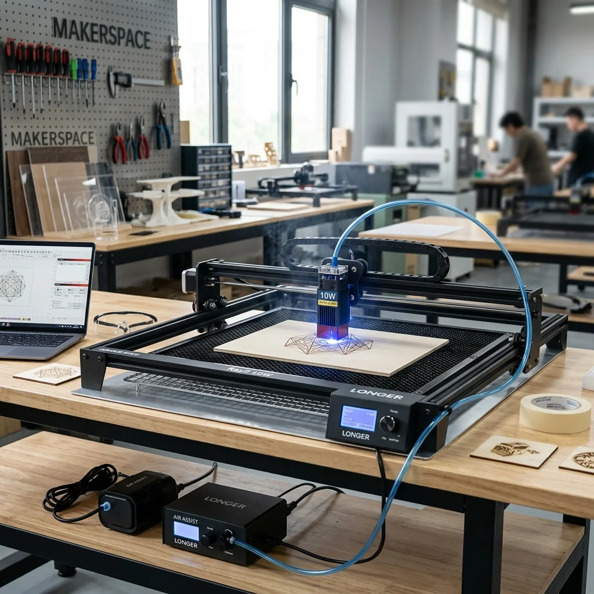

Getting clean, professional-looking results from a diode laser requires more than just assembling the machine and pressing "start". When I first set up my **Longer Ray5 10W**, I quickly realized that to make high-quality, repeatable cuts and detailed engravings without messy charring, I needed to integrate a few essential accessories into my workflow: a honeycomb working bed, an air assist kit, and custom alignment jigs.

This guide covers my physical hardware setup, the configuration settings in LightBurn, and how I handle alignment with and without the honeycomb bed.

---

## My Hardware Stack

Here is the hardware I'm using in my laser workstation. If you are setting up a similar system, these components work together seamlessly:

* **Laser Engraver:** [Longer Ray5 10W Diode Laser Engraver](https://amzn.to/4tPZTbn) – A highly capable, budget-friendly diode laser featuring a 400x400 mm workspace and a built-in touch screen for offline engraving.
* **Air Assist:** [Longer Laser Air Assist Kit](https://amzn.to/4dvPhtm) – An adjustable airflow pump that blows smoke and debris away from the laser nozzle.
* **Working Bed:** [Longer Honeycomb Working Bed (17.3" x 17.3")](https://amzn.to/42XpjZx) – An open metal grid that elevates your material, providing airflow beneath for cleaner cuts and heat dissipation.

## Design Files

* **Alignment Jig File:** [longer-ray5-alignment-jig-10w.lbrn2](longer-ray5-alignment-jig-10w.lbrn2) – This LightBurn project file contains templates for building physical alignment jigs. In this setup, the laser frame is physically attached to the jig base, creating a fixed mechanical relationship between the laser frame and the workspace:
  * **Honeycomb Jig:** A template used to align and position the honeycomb table relative to the laser frame.
  * **No Honeycomb Jig:** A template used to align workpieces directly relative to the laser frame when not using the honeycomb table.

---

## 1. Honeycomb Working Bed Setup

The honeycomb bed is crucial for cutting projects. When you cut wood or acrylic directly on a flat surface, smoke gets trapped underneath the material, causing heavy charring and soot stains on the back side.

### Installation Tips

1. **Workbench Protection:** Always place the included thin aluminum sheet directly on your workbench *first*, and then place the honeycomb bed on top of it. This aluminum sheet acts as a barrier, preventing the laser from burning your workbench when it cuts through workpieces.
2. **Squaring the Bed:** Align the edges of the honeycomb table so they are perfectly square to the frame of your Longer Ray5. If the bed is crooked, alignment lines on the honeycomb grid won't match the movements of your laser axes.
3. **Hold-Down Pins:** The honeycomb bed comes with plastic automotive trim clips that can be used as hold-downs to keep thin, warped sheets of wood flat against the grid.
   * > [!WARNING]
     > Make sure to remove all plastic clips from the table's active cutting and engraving path before using the table for the first time (and before every job). If they are left in the laser's path, the laser beam will melt the plastic, creating toxic fumes and ruining the clips.

---

## 2. Air Assist Integration

Adding air assist is the single biggest upgrade you can make to a diode laser. The stream of compressed air serves two critical functions:

* **Extinguishes Flare-Ups & Charring:** By blowing away combustion gases and heat, it prevents wood from charring or catching fire, yielding clean, bright cut edges.
* **Protects the Lens:** It creates positive pressure at the nozzle, keeping smoke, dust, and vaporized resins from settling on the laser module's protective glass lens.

### Routing the Air Line

When routing the air hose from the pump to the laser head:

* Use zip ties or hook-and-loop straps to bundle the hose along the main wiring harness and cable drag chains.
* **Crucial:** Manually move the laser head to all four corners of the 400x400 mm workspace before turning on the power. Ensure that the air hose has enough slack and does not pull tight, bind, or snag on the frame at the outer limits of travel.

---

## 3. Alignment Jigs (The Secret to Repeatability)

Aligning a workpiece manually with the laser head's red framing light is slow and prone to errors. To solve this, I use physical alignment jigs. In this setup, the laser frame is attached directly to the jig base, ensuring a fixed relationship between the laser frame and the alignment boundaries.

Depending on whether the honeycomb table is used, the jig is designed to align either the honeycomb table or the workpiece relative to the laser frame.

### A. Aligning the Honeycomb Bed (Honeycomb Jig)

Even a slight rotation of the honeycomb table relative to the laser frame will cause cuts and grids to run crooked.

* **The Honeycomb Jig:** This template in the LightBurn file is used to create an alignment jig that fixes the physical position of the honeycomb table relative to the laser frame.
* **How it works:** With the laser frame physically attached to the jig, the jig guides are positioned to square the honeycomb table. When the honeycomb table is placed against these stops, it is locked in perfect alignment (both parallel and square) with the laser's movement axes.
* **Software Setup:** Since the table is perfectly aligned with the laser travel, any grid-based alignment in LightBurn will match physical reality.

### B. Aligning Workpieces Directly (No Honeycomb Jig)

When engraving thick items, you need to remove the honeycomb table for vertical clearance. In these cases, you still need a way to align workpieces consistently relative to the laser frame.

* **The No Honeycomb Jig:** This template is used to create an alignment jig when you are engraving directly on the base plate or wasteboard.
* **How it works:** Since the laser frame is attached to the jig base, the jig provides physical registration stops or slots directly relative to the frame. Sliding a workpiece into this corner slot automatically aligns it square and true relative to the laser frame and its origin.
* **Software Setup:** In LightBurn, place your design relative to the fixed coordinate of the jig's corner stop. Every time you slide a new workpiece into the slot, it will engrave in the exact same spot.

---

## 4. Software Configuration (LightBurn)

For the best experience, I recommend using **LightBurn** over LaserGRBL. It provides much better control over layer settings and machine configuration.

### Device Profile Settings

When setting up your Longer Ray5 10W in LightBurn, use these settings:

* **Controller Type:** GRBL
* **Connection Type:** Serial/USB
* **Working Area:** `400.0 mm x 400.0 mm`
* **Origin:** Front-Left (Bottom-Left)
* **Baud Rate:** `115200`
* **Auto-Home on Startup:** Enabled (the Ray5 has physical limit switches)

### Critical Settings

* **S-Value Max:** Go to **Edit > Device Settings** and ensure **S-Value Max** is set to `1000`. Diode lasers expect GRBL power scale commands from 0 to 1000. If this is set to another number (like 255), the laser will either run underpowered or fire at full power constantly.
* **Baud Rate:** If you experience connection drops, ensure you are using a high-quality USB cable and that the baud rate is locked to `115200`.

---

## 5. Focusing Procedure

The Longer Ray5 10W has a fixed focal length of **50mm**. Setting the focus height is quick using the metal cylinders/blocks provided by Longer:

1. Place your workpiece (and honeycomb bed if using one) under the laser head.
2. Loosen the thumbscrew on the side of the laser module carriage.
3. Place the focus spacer cylinder on top of your workpiece, directly beneath the metal nozzle.
4. Gently lower the laser module until its metal base rests flush on top of the cylinder.
5. Tighten the thumbscrew to lock the laser module in position.
6. **Important:** Remove the focusing cylinder before starting the job!

By combining proper focusing, air assist cooling, a honeycomb bed, and alignment templates, you'll see a massive increase in detail and a reduction in scorched surfaces. Happy making!
